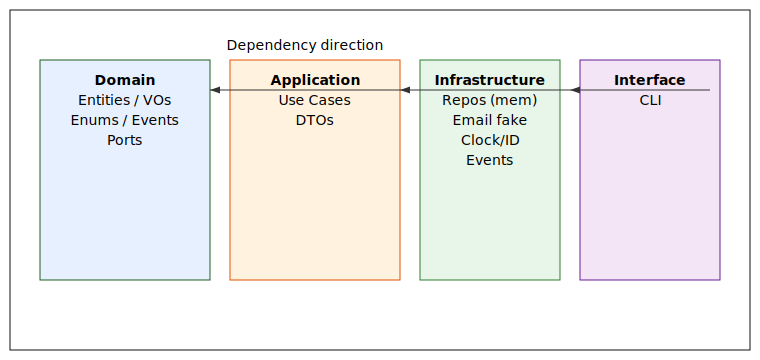
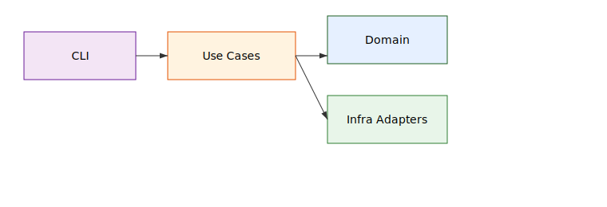
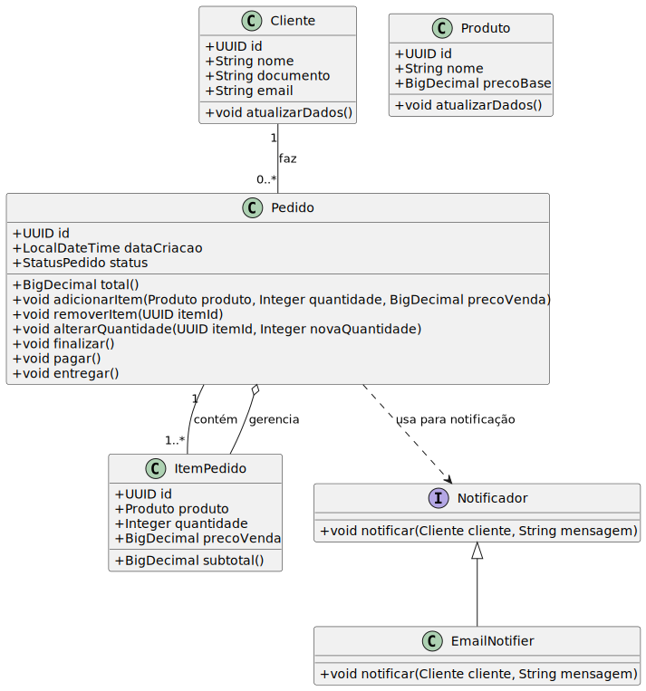
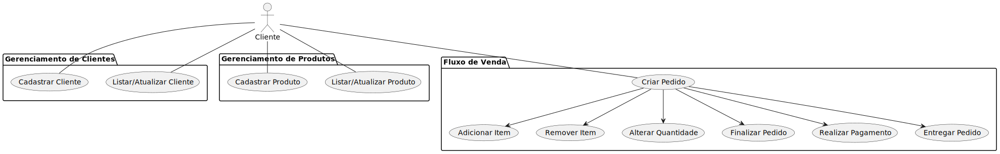
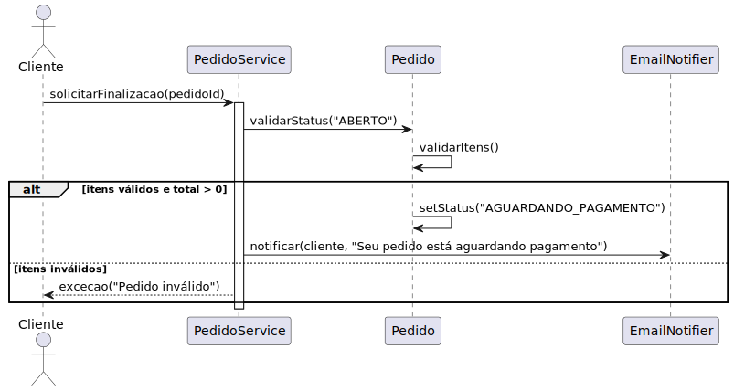
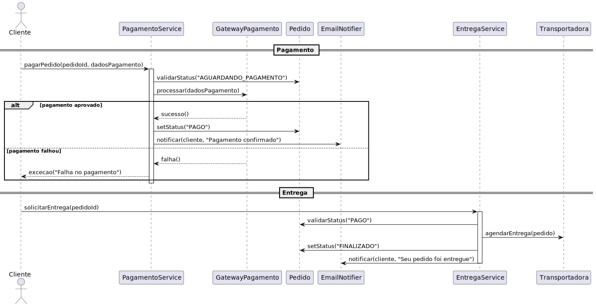

# Ada Commerce — Núcleo sem API

**Problema**: implementar o núcleo de um e‑commerce educacional para cadastro de clientes/produtos e fluxo de pedidos (itens, finalização, pagamento, entrega), sem REST nesta etapa.
**Meta**: base limpa, testável e extensível.

## Escopo
- Clientes: criar, listar, atualizar. Sem exclusão.
- Produtos: criar, listar, atualizar. Sem exclusão.
- Pedidos: criar, adicionar/alterar/remover itens enquanto **OPEN**; finalizar → **AWAITING_PAYMENT**; pagar → **PAID**; entregar → **FINISHED**.
- Notificação: console (e-mail fake).
- Fora do escopo: autenticação, estoque, gateway de pagamento, banco real, REST.

## Tecnologias
- **Java 17**
- **Gradle** (wrapper) e **JUnit 5**
- **GitHub CLI (`gh`)** para automações de rótulos e issues
- Estrutura **Clean Architecture**

## Estrutura do projeto
```
src/
  main/java/com/ada/commerce/
    domain/            # Entidades, VOs, Enums, Portas, Eventos
    application/       # Casos de uso + DTOs
    infrastructure/    # Adapters (memória, notificador, eventos, clock/id)
    interfaceadapters/ # CLI de demonstração (próxima etapa)
  test/java/...        # Testes de unidade
docs/
  diagrams/            # Diagramas da solução (SVG/PNG)
.github/
  ISSUE_TEMPLATE/      # Templates de issue
  workflows/           # CI placeholder
scripts/               # Automação de labels e issues
```
### Visão de camadas


### Fluxo alto nível


### Diagrama de Classes


### Casos de Uso


### Diagrama de Sequencia - Pedido


### Diagrama de Sequencia - Entrega e Pagamento


## Como usar localmente
> Pré‑requisitos: JDK 17, Git, GitHub CLI (`gh`).
```bash
# 1) Descompactar e entrar
unzip ada-commerce-pro.zip
cd ada-commerce-pro

# 2) Inicializar git e primeiro commit
git init
git add .
git commit -m "docs: bootstrap do repositório"

# 3) Criar repositório no GitHub e subir
gh repo create ada-commerce --public --source=. --remote=origin --push

# 4) Criar rótulos e issues iniciais
chmod +x scripts/github_labels.sh scripts/github_issues.sh
./scripts/github_labels.sh
./scripts/github_issues.sh
```

### Rodar build e testes
Ainda sem código. O build já valida o JDK e executa a suíte vazia.
```bash
./gradlew test
```

## Como adicionar seus diagramas
- Coloque arquivos em `docs/diagrams/` com nomes claros, por exemplo: `context.svg`, `containers.svg`.
- No README, referencie com:
```markdown

```
- SVG é preferível por legibilidade no GitHub. PNG também funciona.

## Issues e Pull Requests
**Issues**: são cartões de trabalho. Use os templates para criar:
- `Task`: tarefa técnica granular.
- `Story`: história funcional com critérios de aceite.
- `Bug`: defeito com passos de reprodução.

**Fluxo sugerido**:
1. Crie uma issue. Defina escopo e critérios de aceite.
2. Crie branch: `feat/<escopo>` ou `fix/<escopo>`.
3. Commits no padrão **Conventional Commits** (`feat:`, `fix:`, `test:`, `docs:`, `refactor:`, `chore:`).
4. Abra um PR pequeno. Preencha o template. Peça 1 review.
5. Merge via **Squash**. Branch `main` protegida.

## Roadmap
- Fase 1: núcleo sem API (este repo).
- Fase 2: REST fina mapeando casos de uso.
- Fase 3: persistência real e estoque.
- Fase 4: integrações externas.

## Licença
MIT. Ver `LICENSE`.
